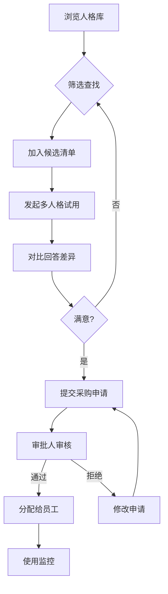

## 1. Product Overview
AI 人格市场是面向企业客户的 AI 服务平台，帮助企业挑选适合的客服、销售陪练和培训讲师类 AI 人格。平台提供人格展示、评测对比、采购申请和使用监控等核心功能。

## 2. Core Features

### 2.1 User Roles
| Role | Registration Method | Core Permissions |
|------|---------------------|------------------|
| 企业用户 | 企业邮箱注册/认证 | 浏览人格库、试用 AI 人格、提交采购申请 |
| 采购审批人 | 管理员分配 | 审批采购申请、分配 AI 人格给员工 |
| 管理员 | 系统后台配置 | 设置可用额度、管理人格状态、查看使用数据 |

### 2.2 Feature Module
1. **企业首页**: 平台概览、热门人格推荐、统计数据展示
2. **人格库**: 按行业/任务/合规等级/响应风格筛选、人格卡片展示
3. **评测对比**: 多人格同时试用、同一问题对比回答差异
4. **采购申请**: 候选清单管理、用途填写、审批流程
5. **使用监控**: 调用量统计、满意度分析、异常反馈、到期提醒

### 2.3 Page Details
| Page Name | Module Name | Feature description |
|-----------|-------------|---------------------|
| 企业首页 | Hero Section | 平台介绍、核心价值展示 |
| 企业首页 | Stats Cards | 人格数量、企业客户数、满意度等关键指标 |
| 企业首页 | Featured Personalities | 热门/推荐人格卡片展示 |
| 人格库 | Filter Bar | 行业、任务类型、合规等级、响应风格多维度筛选 |
| 人格库 | Personality Grid | 人格卡片网格展示，支持多选 |
| 评测对比 | Trial Panel | 输入问题，同时对比多人格回答 |
| 评测对比 | Comparison Table | 展示各个人格的回答差异和评分 |
| 采购申请 | Candidate List | 候选人格清单管理 |
| 采购申请 | Application Form | 填写用途、数量、审批流程提交 |
| 采购申请 | Approval History | 查看申请状态和审批记录 |
| 使用监控 | Dashboard | 调用量、满意度、异常反馈数据可视化 |
| 使用监控 | Risk Management | 风险人格管理、额度设置 |
| 使用监控 | Renewal Reminder | 到期续约提醒列表 |

## 3. Core Process

### User Flow: 发现 -> 试用 -> 采购
1. 企业用户浏览人格库，通过筛选找到合适的 AI 人格
2. 将感兴趣的人格加入候选清单
3. 进入评测对比页面，发起多人格试用
4. 对同一问题查看各个人格的回答差异
5. 选择满意的人格，提交采购申请
6. 审批人审核通过后，分配给员工使用
7. 管理员监控使用情况，管理额度和风险

## 4. User Interface Design

### 4.1 Design Style
- **Primary Color**: #6366f1 (Indigo) - 传达专业、可信的企业形象
- **Secondary Color**: #f59e0b (Amber) - 用于强调和交互元素
- **Button Style**: Rounded-lg (12px), 渐变悬停效果
- **Font**: Inter - 现代简洁的无衬线字体
- **Layout**: Card-based design with generous spacing
- **Icon Style**: Lucide React icons, consistent 24px size

### 4.2 Page Design Overview
| Page Name | Module Name | UI Elements |
|-----------|-------------|-------------|
| 企业首页 | Hero | Large headline, gradient background, CTA button |
| 企业首页 | Stats | 4 cards with icon, number, label |
| 企业首页 | Featured | Horizontal scroll card list |
| 人格库 | Filter | Multi-select dropdowns with chips |
| 人格库 | Grid | Responsive masonry grid with checkbox selection |
| 评测对比 | Input | Large textarea, send button |
| 评测对比 | Results | Side-by-side comparison cards |
| 采购申请 | List | Draggable/reorderable list |
| 采购申请 | Form | Stepped form with validation |
| 使用监控 | Charts | Line charts, bar charts, KPIs |

### 4.3 Responsiveness
- Desktop-first approach
- Tablet: 2 columns grid
- Mobile: Single column, collapsible filters

### 4.4 Accessibility
- WCAG 2.1 AA compliance
- Keyboard navigation support
- Screen reader compatible
- Sufficient color contrast
