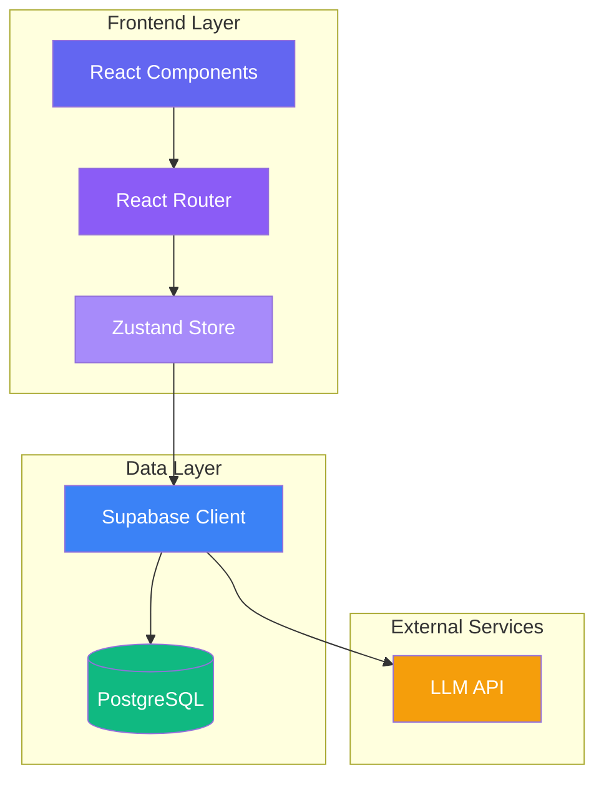
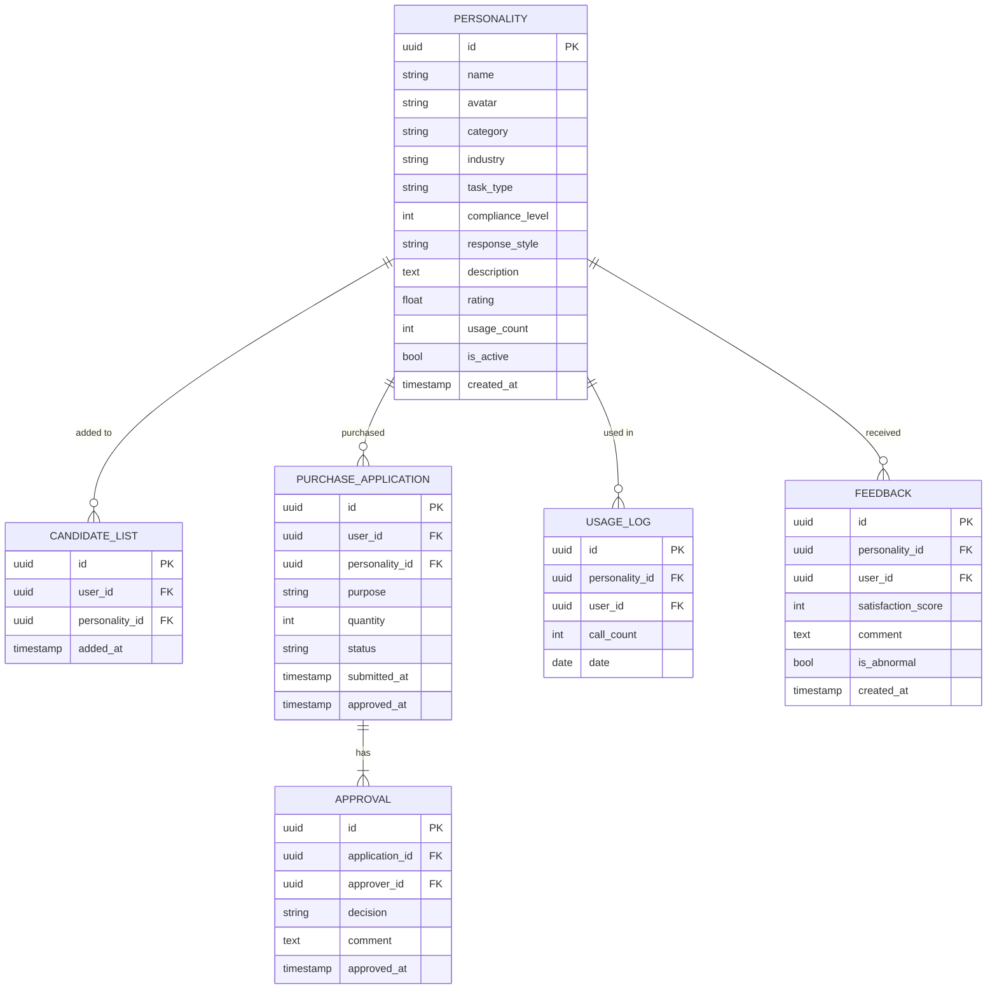

## 1. Architecture Design



## 2. Technology Description
- **Frontend**: React@18 + TypeScript + tailwindcss@3 + vite@6
- **State Management**: Zustand
- **Routing**: React Router DOM@6
- **Icons**: Lucide React
- **Backend**: Supabase (Authentication, Database, Storage)
- **Build Tool**: Vite

## 3. Route Definitions
| Route | Page Component | Purpose |
|-------|---------------|---------|
| / | HomePage | 企业首页，平台概览 |
| /personalities | PersonalityLibrary | 人格库，支持筛选和选择 |
| /compare | ComparePage | 评测对比，多人格试用 |
| /purchase | PurchasePage | 采购申请，候选清单和审批 |
| /monitor | MonitorPage | 使用监控，数据可视化 |

## 4. Data Model

### 4.1 Entity Relationship Diagram



### 4.2 Data Definition Language

```sql
-- Personalities Table
CREATE TABLE personalities (
    id UUID PRIMARY KEY DEFAULT uuid_generate_v4(),
    name VARCHAR(100) NOT NULL,
    avatar VARCHAR(255),
    category VARCHAR(50) NOT NULL,
    industry VARCHAR(50),
    task_type VARCHAR(50),
    compliance_level INT DEFAULT 1 CHECK (compliance_level BETWEEN 1 AND 5),
    response_style VARCHAR(50),
    description TEXT,
    rating FLOAT DEFAULT 0 CHECK (rating BETWEEN 0 AND 5),
    usage_count INT DEFAULT 0,
    is_active BOOLEAN DEFAULT true,
    created_at TIMESTAMP DEFAULT CURRENT_TIMESTAMP
);

-- Candidate List Table
CREATE TABLE candidate_list (
    id UUID PRIMARY KEY DEFAULT uuid_generate_v4(),
    user_id UUID REFERENCES auth.users(id) ON DELETE CASCADE,
    personality_id UUID REFERENCES personalities(id) ON DELETE CASCADE,
    added_at TIMESTAMP DEFAULT CURRENT_TIMESTAMP
);

-- Purchase Applications Table
CREATE TABLE purchase_applications (
    id UUID PRIMARY KEY DEFAULT uuid_generate_v4(),
    user_id UUID REFERENCES auth.users(id) ON DELETE CASCADE,
    personality_id UUID REFERENCES personalities(id) ON DELETE CASCADE,
    purpose TEXT NOT NULL,
    quantity INT DEFAULT 1 CHECK (quantity > 0),
    status VARCHAR(20) DEFAULT 'pending' CHECK (status IN ('pending', 'approved', 'rejected')),
    submitted_at TIMESTAMP DEFAULT CURRENT_TIMESTAMP,
    approved_at TIMESTAMP
);

-- Approvals Table
CREATE TABLE approvals (
    id UUID PRIMARY KEY DEFAULT uuid_generate_v4(),
    application_id UUID REFERENCES purchase_applications(id) ON DELETE CASCADE,
    approver_id UUID REFERENCES auth.users(id) ON DELETE CASCADE,
    decision VARCHAR(20) CHECK (decision IN ('approve', 'reject')),
    comment TEXT,
    approved_at TIMESTAMP DEFAULT CURRENT_TIMESTAMP
);

-- Usage Logs Table
CREATE TABLE usage_logs (
    id UUID PRIMARY KEY DEFAULT uuid_generate_v4(),
    personality_id UUID REFERENCES personalities(id) ON DELETE CASCADE,
    user_id UUID REFERENCES auth.users(id) ON DELETE CASCADE,
    call_count INT DEFAULT 0,
    date DATE NOT NULL DEFAULT CURRENT_DATE
);

-- Feedback Table
CREATE TABLE feedback (
    id UUID PRIMARY KEY DEFAULT uuid_generate_v4(),
    personality_id UUID REFERENCES personalities(id) ON DELETE CASCADE,
    user_id UUID REFERENCES auth.users(id) ON DELETE CASCADE,
    satisfaction_score INT CHECK (satisfaction_score BETWEEN 1 AND 5),
    comment TEXT,
    is_abnormal BOOLEAN DEFAULT false,
    created_at TIMESTAMP DEFAULT CURRENT_TIMESTAMP
);

-- Indexes
CREATE INDEX idx_personalities_category ON personalities(category);
CREATE INDEX idx_personalities_industry ON personalities(industry);
CREATE INDEX idx_candidate_list_user ON candidate_list(user_id);
CREATE INDEX idx_purchase_applications_status ON purchase_applications(status);
CREATE INDEX idx_usage_logs_date ON usage_logs(date);
```

### 4.3 Supabase Row Level Security Policies

```sql
-- Personalities: Allow all users to read active personalities
CREATE POLICY "Allow read access to active personalities" ON personalities
    FOR SELECT USING (is_active = true);

-- Candidate List: Users can only access their own list
CREATE POLICY "Users can view their own candidate list" ON candidate_list
    FOR SELECT USING (auth.uid() = user_id);

CREATE POLICY "Users can add to their candidate list" ON candidate_list
    FOR INSERT WITH CHECK (auth.uid() = user_id);

CREATE POLICY "Users can remove from their candidate list" ON candidate_list
    FOR DELETE USING (auth.uid() = user_id);

-- Purchase Applications: Users can view and submit their own applications
CREATE POLICY "Users can view their own applications" ON purchase_applications
    FOR SELECT USING (auth.uid() = user_id);

CREATE POLICY "Users can submit applications" ON purchase_applications
    FOR INSERT WITH CHECK (auth.uid() = user_id);

-- Approvals: Approvers can manage approvals
CREATE POLICY "Approvers can manage approvals" ON approvals
    FOR ALL USING (auth.uid() = approver_id);

-- Usage Logs: Users can view their own usage
CREATE POLICY "Users can view their own usage" ON usage_logs
    FOR SELECT USING (auth.uid() = user_id);

-- Feedback: Users can submit feedback
CREATE POLICY "Users can submit feedback" ON feedback
    FOR INSERT WITH CHECK (auth.uid() = user_id);
```

## 5. Component Structure

```
src/
├── components/
│   ├── layout/
│   │   ├── Header.tsx
│   │   └── Sidebar.tsx
│   ├── personality/
│   │   ├── PersonalityCard.tsx
│   │   ├── PersonalityFilter.tsx
│   │   └── PersonalityGrid.tsx
│   ├── compare/
│   │   ├── TrialPanel.tsx
│   │   └── ComparisonResult.tsx
│   ├── purchase/
│   │   ├── CandidateList.tsx
│   │   └── ApplicationForm.tsx
│   ├── monitor/
│   │   ├── Dashboard.tsx
│   │   └── Charts.tsx
│   └── common/
│       ├── StatCard.tsx
│       ├── Button.tsx
│       └── Loading.tsx
├── pages/
│   ├── HomePage.tsx
│   ├── PersonalityLibrary.tsx
│   ├── ComparePage.tsx
│   ├── PurchasePage.tsx
│   └── MonitorPage.tsx
├── store/
│   └── index.ts
├── types/
│   └── index.ts
├── utils/
│   └── supabase.ts
└── App.tsx
```

## 6. State Management Structure

```typescript
interface AppState {
  // Auth
  user: User | null;
  isAuthenticated: boolean;
  
  // Personality Filter
  filters: {
    industry: string[];
    taskType: string[];
    complianceLevel: number[];
    responseStyle: string[];
  };
  
  // Candidate List
  candidateList: Personality[];
  
  // Compare
  compareList: Personality[];
  trialResults: TrialResult[];
  
  // Purchase
  applications: PurchaseApplication[];
  
  // Monitor
  usageData: UsageData[];
  feedbackData: Feedback[];
}
```

## 7. API Endpoints (Supabase Functions)

| Function | Purpose | Parameters | Returns |
|----------|---------|------------|---------|
| getPersonalities | 获取人格列表 | filters: FilterParams | Personality[] |
| getPersonalityById | 获取单个人格 | id: string | Personality |
| addToCandidateList | 添加到候选清单 | personalityId: string | void |
| removeFromCandidateList | 从候选清单移除 | personalityId: string | void |
| submitPurchaseApplication | 提交采购申请 | application: PurchaseApplicationInput | PurchaseApplication |
| getPurchaseApplications | 获取采购申请列表 | status?: string | PurchaseApplication[] |
| approveApplication | 审批申请 | applicationId: string, decision: string | void |
| getUsageData | 获取使用数据 | dateRange: DateRange | UsageData[] |
| submitFeedback | 提交反馈 | feedback: FeedbackInput | Feedback |
| updatePersonalityStatus | 更新人格状态 | id: string, isActive: boolean | void |
